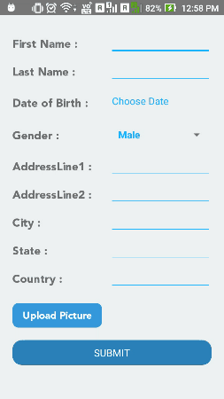

# Portfolio

### App demo

*-This project contains a simple react-native form that lets user input values and generate its completed form on the summary page.-*

#### Features involved: 
* Getting input from user using TextInput
* Native DatePicker is used for getting Date
* ImagePicker module integrated for capturing pics and retrieving pics from gallery.
* Cropping, resizing and rotation of pics is possible

## Getting Started

### Clone the project
`git clone https://github.com/goyalanshu/Portfolio.git`

#### Basic Usage

* Install npm modules in your project directory

      $ npm install
      
* Install third party libraries used in this project

      $ npm install react-native-datepicker
      $ npm install react-native-image-crop-picker
      $ npm install react-native-router-flux
      $ npm install native-base
  
* Link these installed libraries by:

      $ react-native link
  
* For running the app: 

      $ react-native run-android
      
## Contribution

* <a href="">@ Anshu Goyal</a> The main Author
* <a href="">@ Girish Kumar Gupta</a> Contributor
* <a href="">@ Simerdeep Singh</a> Contributor
